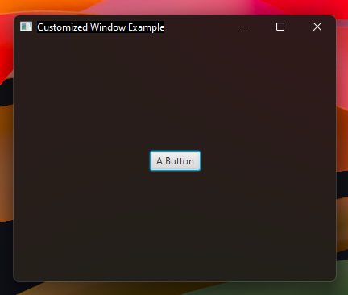

# Customize JavaFX stages on Windows 11

A small collection of utility methods to customize a JavaFX stage. Targets Windows 11+, won't show any effect on unsupported OSes.

```java
import io.github.mimoguz.custom_window.StageOps;

import javafx.application.Application;
import javafx.application.Platform;
import javafx.geometry.Pos;
import javafx.scene.Scene;
import javafx.scene.control.Button;
import javafx.scene.layout.VBox;
import javafx.scene.paint.Color;
import javafx.stage.Stage;

public class Example extends Application {
    public static void main(final String[] args) {
        launch();
    }

    @Override
    public void start(final Stage stage) {
        final var button = new Button("A Button");

        final var root = new VBox();
        root.setAlignment(Pos.CENTER);
        root.getChildren().add(button);
        root.setStyle("-fx-background-color: rgb(2, 48, 71);");

        final var scene = new Scene(root, 400, 300);
        stage.setScene(scene);

        stage.setTitle("Customized Window Example");

        Platform.runLater(() -> {
            final var handle = StageOps.findWindowHandle(stage);
            StageOps.setCaptionColor(handle, Color.rgb(2, 48, 71));
            StageOps.setTextColor(handle, Color.rgb(142, 202, 230));
            StageOps.setBorderColor(handle, Color.rgb(251, 133, 0));
        });

        stage.show();
    }
}
```


## The Mica Material

You can apply the mica material to your stage like this:

```java
@Override
public void start(final Stage stage) {
    final var button = new Button("A Button");

    final var root = new VBox();
    root.setAlignment(Pos.CENTER);
    root.getChildren().add(button);
    root.setStyle("-fx-background-color: transparent");

    final var scene = new Scene(root, 400, 300);
    scene.setFill(Color.TRANSPARENT);
    stage.setScene(scene);

    stage.initStyle(StageStyle.UNIFIED);
    stage.setTitle("Customized Window Example");

    Platform.runLater(() -> {
        final var handle = StageOps.findWindowHandle(stage);
        // Optionally enable the dark mode:
        StageOps.dwmSetBooleanValue(handle, DwmAttribute.DWMWA_USE_IMMERSIVE_DARK_MODE, true);
        // Enable the mica material
        // DWMWA_SYSTEMBACKDROP_TYPE method is the newer way:
        if (!StageOps.dwmSetIntValue(
                handle,
                DwmAttribute.DWMWA_SYSTEMBACKDROP_TYPE,
                // There is also DWMSBT_TABBEDWINDOW option, which gives a more translucent look.
                DwmAttribute.DWMSBT_MAINWINDOW.value
        )) {
            // This is the "old" way:
            StageOps.dwmSetBooleanValue(handle, DwmAttribute.DWMWA_MICA_EFFECT, true);
        }
    });
```



<del>If you look closely at the screenshot, you will see that the title text background is still opaque. 
From what I gathered so far, to fix this we need to add WS_EX_NOREDIRECTIONBITMAP to extended window styles 
(and maybe a couple other sytles, but that's the problematic one). That, apparently, cannot be done after the window 
was created. So I think a JavaFX level fix (in GlassWindow.cpp) is needed here.</del>

Windows 11 22H2 update solved the opaque title text background issuse. But, to make the mica effect work reliably, 
you will -most probably- need to set ```prism.forceUploadingPainter``` JVM option to ```true``` 
([the related issue](https://github.com/mimoguz/custom_window/issues/2)). 
For Maven, you can add this option to JavaFX plugin configuration in your ```pom.xml```, like this:

```xml
<plugin>
    <groupId>org.openjfx</groupId>
    <artifactId>javafx-maven-plugin</artifactId>
    <version>0.0.8</version>
    <configuration>
        <mainClass>Example</mainClass>
        <options>
          <option>-Dprism.forceUploadingPainter=true</option>
        </options>
    </configuration>
</plugin>
```

This unfortunetely may have adverse effects on performance, Eroica (the one who did/does all the hard work) found out. 
If you're interested in using the mica effect in your JavaFX app, you might want to read their posts in the linked issue.


